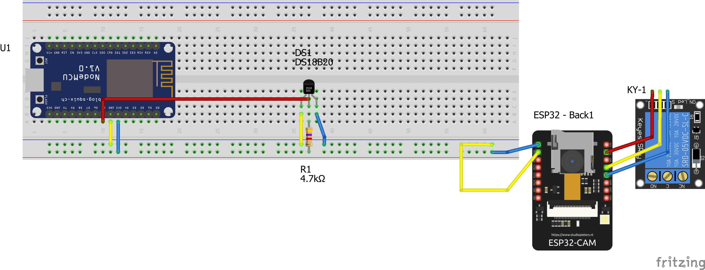

# Thermostat base

### Demo
![Demo video][demolocal]  
[Watch it on YT][demoyt]

## Schematics  

  
(yellow = GND, blue=VCC/LIVE/5V, red= information)
## Description  

Project is meant to act as a base for developing a smart thermostat for a central heating system at home. The sender and receiver communicate via WIFI, and the heating system would be connected to the components through the relay (NO and COM ports).  
Potential improvements - change boards to more efficient ones, BLE-enabled for lower power draw; change communication system to BLE; design layout to occupy the least space; design and manufacture enclose; allow for manual setting of temperature threshold via physical buttons / WIFI / BT.

## Pre-requisites  

Individual components:
- NODEMCU v1.0 ESP8266 (ESP8266EX) dev board [Link to specsheet for ESP8266](https://www.espressif.com/sites/default/files/documentation/0a-esp8266ex_datasheet_en.pdf)
- AI-THINKER ESP32-CAM board (comes with ESP32-CAM-MB programmer) [Link to specsheet](https://docs.ai-thinker.com/_media/esp32/docs/esp32-cam_product_specification_zh.pdf)
- DS18B20 temperature sensor (running it in Parasite mode, meaning information pin also powers it, so VCC is connected to GND) [Link to specsheet](https://cdn.sparkfun.com/datasheets/Sensors/Temp/DS18B20.pdf)
- 5V single relay (JQC3F-5VDC-C or SRD-05VDC-SL-C) [Specsheet](https://components101.com/sites/default/files/component_datasheet/Relay-Module-Datasheet.pdf)
- 4.7K Resistor (5K is fine)
  
Software:
- [Arduino IDE](https://www.arduino.cc/en/software)
- CH340 driver (cannot provide link due to unofficial sources)
  
Miscellaneous:
- jumper wires
- 2 USB ports on laptop/desktop device

### SETUP & INSTALL  
- for NODEMCU ESP8266 board we need to follow [these instructions](https://protosupplies.com/product/esp8266-nodemcu-v1-0-esp-12e-wifi-module/) so that the IDE recognizes our board;
- connect components like in schematic or demo
- install DallasTemperature and OneWire libraries for sender (ESP8266 board)
- the NODEMCU board will use the code from wifiSender
- the ESP32 board will use the code from wifiReceiver
- modify temperature threshold in code (wifiSender) if needed
- upload the code to the board (ESP32 will need to be fully connected to ESP32-CAM-MB during programming, then it can be broken like in schematic or demo)

### RUNNING  
- power boards via usb (or modify project to allow for separate power source)
- the ESP32 red LED indicates when the circuit is closed (meaning heat will be turned on when connected to heating system via 2-core 240V wires from relay)
- relay indicates heating would be on by having only red light on; green light on indicates open circuit

## NOTES
- dev boards were chosen for prototyping & versatility reasons
- proper deployment requires modifications in used components and code efficiency

[demolocal]:demoThermostat-IoT.gif
[demoyt]:https://youtube.com/shorts/qt1d3cgY5dI
